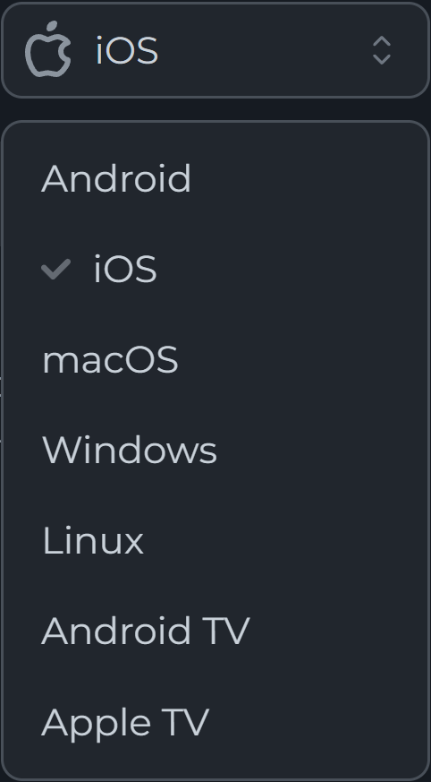
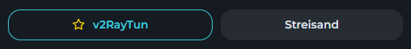

# Как подлючиться?
## 1. Оплатить подписку в Mist VPN
 - Перейди в [Telegram-бота Mist VPN](https://t.me/mistvpn_bot)
 -  Пополни баланс:
    `Личный кабинет -> Баланс -> Пополнить`  

    *Подписка продлевается автоматически, если есть необходимая сумма на балансе.*

## 2. Перейти на страницу подписки
 - Перейди на страницу своей подписки:
    `Личный кабинет -> Подписка -> Перейти на страницу подписки`
 - Выбери нужную платформу из списка:  

  
    

 - Выбери необходимое приложение. Если не уверен, какое выбрать — выбери то, которое стоит по умолчанию и помечено звездочкой.
 

  
    

 - Следуй инструкциям на странице подписки — от установки до подключения.